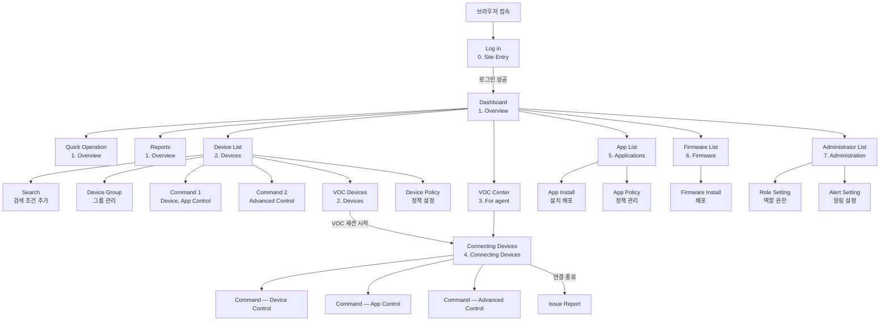

# RMS Flipbook 스펙 문서

> 원본 프로토타입: https://lsx333.axshare.com/?g=14&id=release_history
> 마지막 업데이트: 2026-04-28

## 메타 문서

- [Release History](./00-release-history.md)
- [IA (Information Architecture)](./00-ia.md)
- [Policy (공통 정책)](./00-policy.md)

## 섹션

- [0. Site Entry](./0-site-entry/index.md)
- [1. Overview](./1-overview/index.md)
- [2. Devices](./2-devices/index.md)
- [3. VOC Center (For agent)](./3-voc-center-for-agent/index.md)
- [4. Connecting Devices](./4-connecting-devices/index.md)
- [5. Applications](./5-applications/index.md)
- [6. Firmware](./6-firmware/index.md)
- [7. Administration](./7-administration/index.md)
- [8. Set-top box UI scenario](./8-set-top-box-ui-scenario/index.md)

## 전체 사이트맵

```
RMS Flipbook
├── Release History                        [release_history.html]
├── IA                                     [ia.html]
├── Policy                                 [policy.html]
│
├── 0. Site Entry
│   └── Log in                             [log_in.html]
│
├── 1. Overview
│   ├── Dashboard_1 depth                  [dashboard_1_depth.html]
│   ├── Dashboard_2 depth                  [dashboard_2_depth.html]
│   ├── Quick Operation                    [quick_operation.html]
│   └── Reports                            [reports.html]
│
├── 2. Devices
│   ├── Device List                        [device_list.html]
│   ├── Search                             [search.html]
│   ├── Device Group                       [device_group.html]
│   ├── Command (1)                        [command__1_.html]
│   ├── Command (2)                        [command__2_.html]
│   ├── VOC Devices                        [voc_devices.html]
│   └── Device Policy                      [device_policy.html]
│
├── 3. VOC Center (For agent)
│   └── VOC Devices                        [voc_devices_1.html]
│
├── 4. Connecting Devices
│   ├── Connecting Devices Policy          [connecting_devices_policy.html]
│   ├── Connecting Devices                 [connecting_devices.html]
│   ├── Command>Device Control             [command_device_control.html]
│   ├── Command>App Control                [command_app_control.html]
│   ├── Command>Advanced Control           [command_advanced_control.html]
│   └── Issue report                       [issue_report.html]
│
├── 5. Applications
│   ├── App List                           [app_list.html]
│   ├── App Install                        [app_install.html]
│   └── App Policy                         [app_policy.html]
│
├── 6. Firmware
│   ├── Firmware List                      [firmware_list.html]
│   └── Firmware Install                   [firmware_install.html]
│
├── 7. Administration
│   ├── Administrator List                 [administrator_list.html]
│   ├── Role Setting                       [role_setting.html]
│   └── Alert Setting                      [alert_setting.html]
│
└── 8. Set-top box UI scenario
    └── Set-top box UI scenario            [set-top_box_ui_scenario.html]
```

## 주요 화면 흐름


